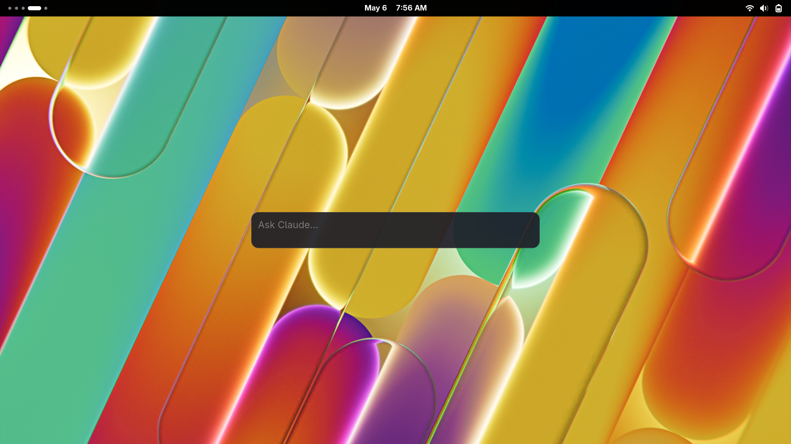

# claude-code-launcher

A small GTK4 popup launcher for [Claude Code](https://claude.com/product/claude-code) on Linux.

Bind it to a global hotkey, type a prompt, hit Enter — your terminal opens with `claude` already running on it.



## Requirements

- Linux with GTK4 (≥ 4.12) at runtime
- Rust toolchain (only for building / installing)
- A terminal emulator of your choice
- The `claude` CLI on your PATH

## Install

From crates.io-style remote:

```sh
cargo install --git https://github.com/jamesdedon/claude-code-launcher
```

Or from a local checkout:

```sh
git clone https://github.com/jamesdedon/claude-code-launcher
cd claude-code-launcher
cargo install --path .
```

Either compiles a release binary and installs it to `~/.cargo/bin/claude-code-launcher`. Make sure `~/.cargo/bin` is on your `PATH`.

## Configuration

Create `~/.config/claude-code-launcher/config.toml`:

```toml
working_directory = "/absolute/path/to/your/projects/dir"
terminal_command = ["ptyxis", "--new-window", "--working-directory", "{cwd}", "--", "claude", "{prompt}"]
```

Both fields are required. The launcher refuses to open if either is missing or invalid.

- **`working_directory`** — where Claude Code will run (use an absolute path; `~` is not expanded). Used as the default project when no `[[projects]]` are listed.
- **`terminal_command`** — argv array for spawning your terminal. The strings `{cwd}` and `{prompt}` are substituted at launch time.

### Optional fields

```toml
# Capacity of the persistent prompt history (default 100).
history_size = 100

# Args spliced before {prompt} when you launch with Ctrl+Enter (resume mode).
resume_args = ["--resume"]

# Multiple project working directories. When set, a label above the input
# shows the active project and Ctrl+Tab / Ctrl+Shift+Tab cycle through them.
[[projects]]
name = "launcher"
path = "/home/you/Projects/claude-code-launcher"

[[projects]]
name = "notes"
path = "/home/you/Documents/notes"
```

### Examples for other terminals

```toml
# Alacritty
terminal_command = ["alacritty", "--working-directory", "{cwd}", "-e", "claude", "{prompt}"]

# Kitty
terminal_command = ["kitty", "--directory", "{cwd}", "claude", "{prompt}"]

# Foot
terminal_command = ["foot", "--working-directory={cwd}", "claude", "{prompt}"]

# GNOME Terminal
terminal_command = ["gnome-terminal", "--working-directory={cwd}", "--", "claude", "{prompt}"]

# WezTerm
terminal_command = ["wezterm", "start", "--cwd", "{cwd}", "--", "claude", "{prompt}"]
```

## Bind a hotkey (GNOME)

1. Open **Settings → Keyboard → View and Customize Shortcuts → Custom Shortcuts**.
2. Click **Add Shortcut**.
3. Fill in:
   - **Name**: Claude Code Launcher
   - **Command**: `claude-code-launcher` (or full path `/home/you/.cargo/bin/claude-code-launcher`)
   - **Shortcut**: pick something free — `Super+Return`, `Ctrl+Alt+Space`, `Super+/`, etc. (`Super+Space` is taken by GNOME's overview.)
4. Hit your shortcut. The popup should appear.

For KDE, Sway, Hyprland, i3, etc.: bind the same command in your compositor's keybinding config.

## Usage

The popup is a chromeless translucent box with rounded corners. It appears wherever your compositor decides; drag it from anywhere inside to move it.

- **Type and Enter** — launches Claude in your terminal with the prompt as initial input, and closes the popup.
- **Shift+Enter** — insert a newline. Long prompts wrap and the popup grows downward, scrolling once it hits a height cap.
- **Ctrl+Enter** — launch with `--resume` (configurable via `resume_args`) so Claude opens its session picker instead of starting fresh.
- **Up / Down** — at the first/last line of the input, recall older/newer prompts from history. History is persisted across sessions to `$XDG_STATE_HOME/claude-code-launcher/history.toml`.
- **Ctrl+Tab / Ctrl+Shift+Tab** — cycle the active project (only when multiple `[[projects]]` are configured).
- **`/` then Tab** — autocomplete a slash command from `~/.claude/commands/*.md`. Up/Down moves the suggestion selection while the list is visible.
- **Esc** — dismiss the slash-command list if open, otherwise close the popup.
- **Empty prompt + Enter** — does nothing.

## How it works

The binary spawns your configured terminal command as a child process, with `{cwd}` and `{prompt}` substituted in. If it detects it's running inside a Flatpak sandbox or Toolbox container (via `/run/.containerenv`), it prepends `flatpak-spawn --host` so the host terminal is launched instead of trying (and failing) to find one inside the sandbox.
